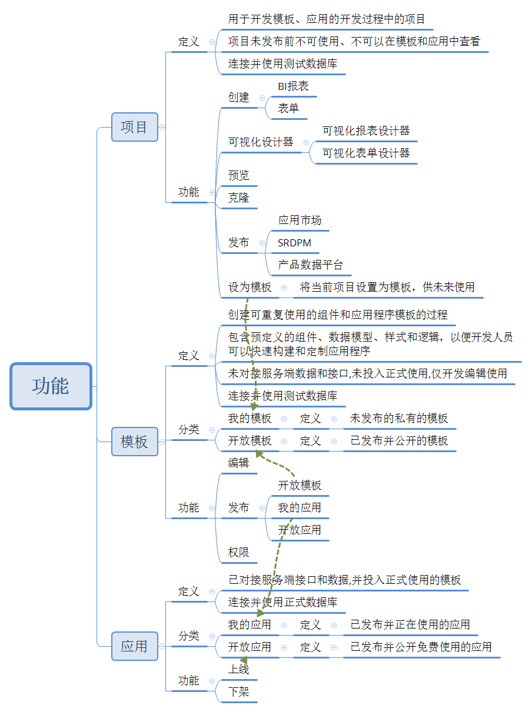
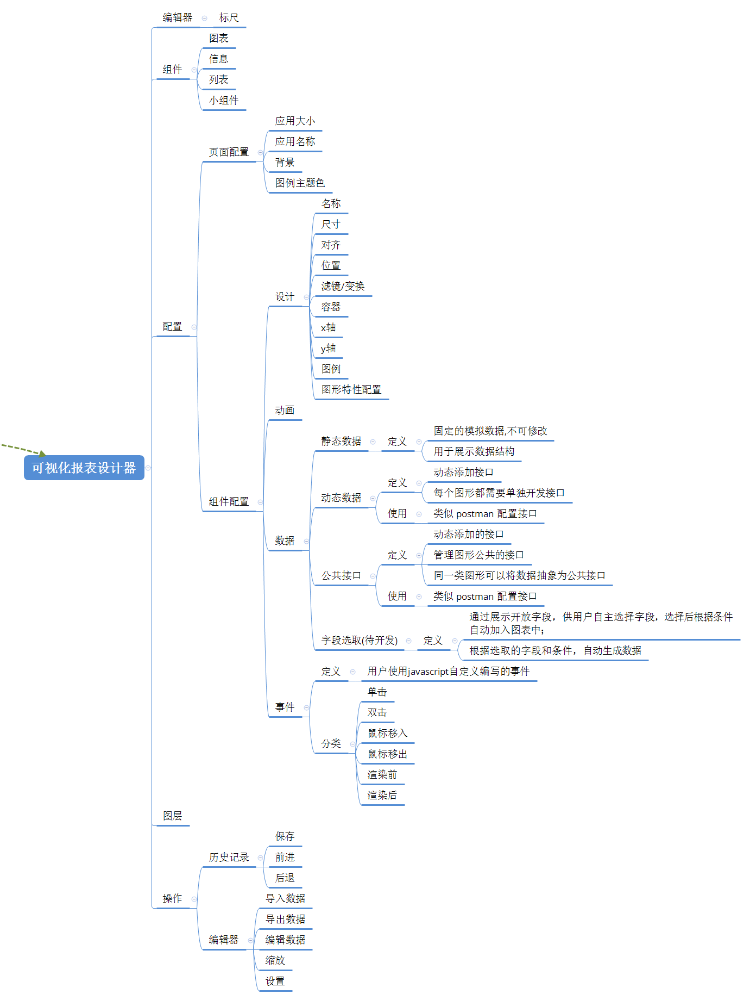

## 需求分析

### 背景

* `为了提高数字门槛和软件生产效率，让非专业开发人员也能够快速构建和维护报表，满足数字化转型的需求 `

### 目标

* 提供一个零代码平台，让非专业开发人员也能够**快速构建和维护报表**；
* 可以自由**结合公司内部现有系统数据**，制作BI报表应用；
* 可以**开放应用**，将应用发布到指定系统，对外使用；

### 范围

* 使用人员：**没有编程基础的**非专业开发人员、公司内部业务、信息系统开发员等；

### 功能

#### 总览

#### 可视化编辑器

#### 组件配置

##### 组件数据

组件数据展示方式有四种：

* 静态数据
* 动态数据
* 公共接口
* 动态字段（待开发）：通过展示开放字段，供用户自主选择字段，选择后根据条件自动加入图表中；

## 项目规划

### 项目里程碑

### 项目计划

#### 开发进度

| 模块         | 功能     | 内容           | 进度 | 计划完成 | 状态 |
| ------------ | -------- | -------------- | ---- | -------- | ---- |
|              |          | 列表           |      |          |      |
| 项目         | 项目列表 | 新增           |      |          |      |
|              |          | 删除           |      |          |      |
|              |          | 编辑           |      |          |      |
|              |          | 预览           |      |          |      |
|              |          | 克隆           |      |          |      |
|              |          | 发布(模板)     |      |          |      |
|              |          |                |      |          |      |
|              |          |                |      |          |      |
| 可视化编辑器 | 布局     |                |      |          |      |
|              | 编辑器   |                |      |          |      |
|              | 操作     |                |      |          |      |
|              | 组件     |                |      |          |      |
|              | 页面配置 |                |      |          |      |
|              | 组件配置 | 数据接口       |      |          |      |
|              |          |                |      |          |      |
|              |          |                |      |          |      |
| 模板         |          | 列表           |      |          |      |
|              |          | 编辑           |      |          |      |
|              |          | 删除           |      |          |      |
|              |          | 发布(应用市场) |      |          |      |
|              |          | 权限           |      |          |      |
|              |          |                |      |          |      |
| 应用市场     |          | 列表           |      |          |      |
|              |          | 下线(回到模板) |      |          |      |
|              |          | 删除           |      |          |      |
|              |          |                |      |          |      |

## 开发实施

### 技术实现

###### 历史记录

### 接口

### 代码提交规范

* feat: 新功能
* fix: 修复 Bug
* docs: 文档修改
* perf: 性能优化
* revert: 版本回退
* ci: CICD集成相关
* test: 添加测试代码
* refactor: 代码重构
* build: 影响项目构建或依赖修改
* style: 不影响程序逻辑的代码修改
* chore: 不属于以上类型的其他类型(日常事务)
