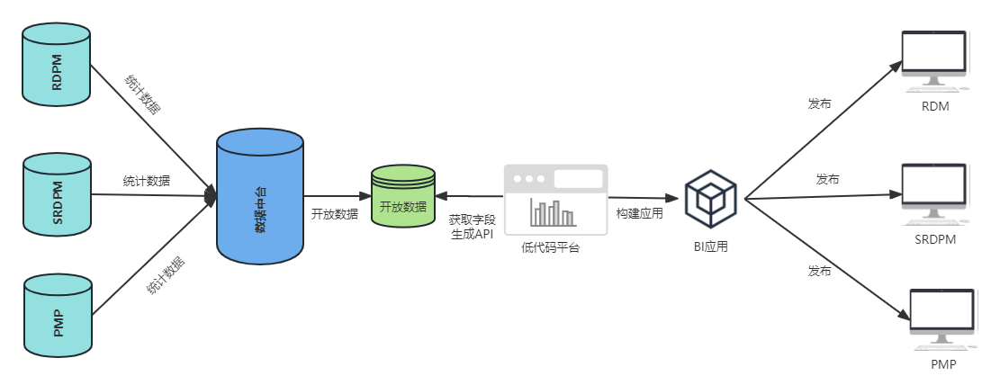
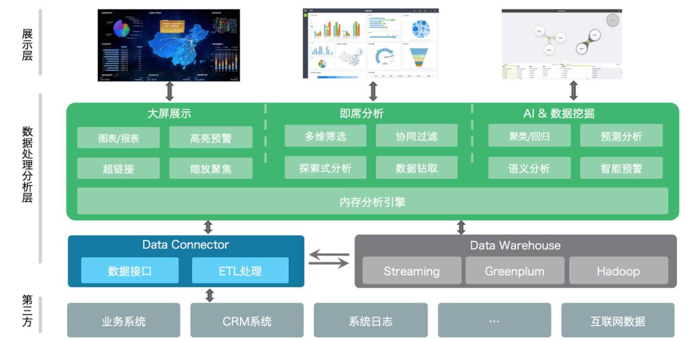
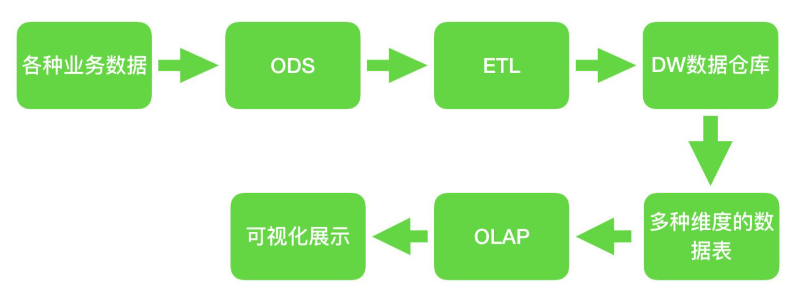
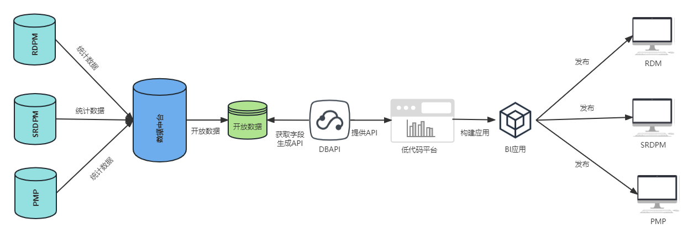

## 需求分析

### 背景

* 为了提高数字门槛和软件生产效率，让非专业开发人员也能够快速构建和维护报表，满足数字化转型的需求，并加快企业数字化进程，我们需要解决以下痛点：
  1. 各专业业务人员具备深入的业务逻辑知识，但缺乏软件系统开发技能。
  2. 软件开发人员参与业务需求调研和需求梳理的成本高昂。
  3. 软件开发流程繁琐，周期长。

----

### 目标

* 提供一个零/低代码平台，让非专业开发人员也能够**快速构建和维护报表**；
* 可以自由**结合公司内部现有系统数据**，制作BI报表应用；
* 可以**开放应用**，将应用发布到指定系统，对外使用；

----

### 范围

* 使用人员：**没有编程基础的**非专业开发人员、公司内部业务、信息系统开发员等；

----

## 方案

* 1.建立数据中台数据库；
* 2.建立低代码平台，从数据中台数据库获取数据；
* 3.通过低代码平台拖拽生成 BI 应用；
* 4.通过 BI 平台发布应用到其他平台；

* 
* BI 架构图

* 智能 BI 数据处理的工作原理

----

## 创新贡献

### 技术或产品水平

#### 技术水平

1. 技术领先：平台采用前后端分离架构，前端采用 Vue3 + naive-ui，具有较高的性能和扩展性。
2. 扩展性强：平台在图表组件中可扩展开发，能够满足用户的个性化需求。
3. 代码质量高：平台的代码质量高，可维护性强，易于二次开发和升级。
4. 开发效率高：平台采用低代码开发模式，能够快速构建和部署BI应用。
5. 数据处理能力强：平台具有强大的数据处理能力，能够处理大规模和复杂的数据。

#### 产品水平

1. 用户体验好：平台的用户界面友好、易用，具有较高的用户满意度。
2. 定制化能力强：平台能够满足不同用户的个性化需求，支持灵活的定制化开发。
3. 安全性高：平台具有严格的安全机制和权限控制，确保数据和应用的安全性。
4. 部署和维护简单：平台能够快速部署和维护，降低用户的运维成本和风险。

### 产品综合竞争力/ 商业模式竞争力/效率/成本改善

#### 产品综合竞争力

1. 定制化能力强：自研BI低代码系统可以根据客户的具体需求进行定制化开发，以满足用户的个性化需求。
2. 灵活性高：自研BI低代码系统的架构和功能可根据业务需求进行灵活调整，可以满足特定的业务场景。
3. 成本控制：自研BI低代码系统的开发和维护成本通常较低，可以根据实际需求进行优化和精简，避免冗余和浪费。
4. 数据安全性：自研BI低代码系统容易实现数据的安全性，因为自研系统可以根据具体业务需求进行安全策略的设计和实现。
5. 技术优势：自研BI低代码系统可以根据最新的技术趋势进行更新和升级，从而保持技术上的领先性和创新性。

#### 效率和成本改善

1. 提高开发效率：自研BI低代码平台采用可视化开发方式，开发人员不需要编写复杂的代码，只需要通过拖拽、配置等简单的操作即可完成BI应用的开发，从而提高开发效率。
2. 降低开发成本：自研BI低代码平台可以减少对开发人员的技术要求，不需要招聘专业的BI开发人员，降低开发成本。
3. 缩短上线时间：自研BI低代码平台能够快速构建和部署BI应用，缩短上线时间，提高业务响应速度。
4. 降低运维成本：自研BI低代码平台能够降低运维成本，因为它具有较高的稳定性和可靠性，减少维护和修复的成本。
5. 提高数据分析效率：自研BI低代码平台提供了丰富的数据可视化和分析功能，能够让用户更加直观地理解数据，提高数据分析效率。
6. 优化决策效果：自研BI低代码平台能够实时监控企业的各项数据指标，帮助管理层迅速发现问题和机会，优化决策效果。

### 独创性

----

## 功能

### 功能总览

#### 可视化编辑器

#### 组件配置

#### 组件数据

组件数据展示方式有四种：

* 静态数据
* 动态数据
* 公共接口
* 动态字段（待开发）：通过展示开放字段，供用户自主选择字段，选择后根据条件自动加入图表中；

----

## 项目规划

### 项目里程碑

### 项目计划

#### 开发进度

| 模块         | 功能     | 内容           | 进度 | 计划完成 | 状态   |
| ------------ | -------- | -------------- | ---- | -------- | ------ |
|              |          | 列表           |      |          | 已完成 |
| 项目         | 项目列表 | 新增           |      |          | 已完成 |
|              |          | 删除           |      |          | 已完成 |
|              |          | 编辑           |      |          | 已完成 |
|              |          | 预览           |      |          | 已完成 |
|              |          | 克隆           |      |          | 已完成 |
|              |          | 发布(模板)     |      |          | 已完成 |
|              |          |                |      |          |        |
|              |          |                |      |          |        |
| 可视化编辑器 | 布局     |                |      |          | 已完成 |
|              | 编辑器   |                |      |          | 已完成 |
|              | 操作     |                |      |          | 已完成 |
|              | 组件     |                |      |          | 已完成 |
|              | 页面配置 |                |      |          | 已完成 |
|              | 组件配置 | 数据接口       |      |          | 已完成 |
|              |          |                |      |          |        |
|              |          |                |      |          |        |
| 模板         |          | 列表           |      |          |        |
|              |          | 编辑           |      |          |        |
|              |          | 删除           |      |          |        |
|              |          | 发布(应用市场) |      |          |        |
|              |          | 权限           |      |          |        |
|              |          |                |      |          |        |
| 应用市场     |          | 列表           |      |          |        |
|              |          | 下线(回到模板) |      |          |        |
|              |          | 删除           |      |          |        |
|              |          |                |      |          |        |

-----

## 开发实施

### 技术实现

#### 前端技术栈

| 技术       | 技术栈                  | 作用 |
| ---------- | ----------------------- | ---- |
| 语言       | TypeScript              |      |
| UI 框架    | naive-ui                |      |
| JS 框架    | Vue3、Pinia、Vue-Router |      |
| 图表       | Echarts、three.js       |      |
| 拖拽       | vue-draggable.js        |      |
| 代码编辑器 | monaco-editor.js        |      |
| html转图片 | html2canvas             |      |

#### 后端技术栈

| 技术     | 技术栈                 | 作用                                                         |
| -------- | ---------------------- | ------------------------------------------------------------ |
| 开发语言 | Node.js                |                                                              |
|          |                        |                                                              |
| 框架     | express 4.x            |                                                              |
|          |                        |                                                              |
|          | express.static         | 静态文件服务                                                 |
| 中间件   | body-parser            | 解析 HTTP 请求的请求体                                       |
|          | cookie-parse           | 解析 HTTP 请求中的 cookie                                    |
|          | log4js                 | 日志管理模块                                                 |
|          |                        |                                                              |
| 插件     | pathParse.js（自定义） | 获取文件夹路径下所有文件对象挂载到 app 实例对象              |
|          | token.js               |                                                              |
|          |                        |                                                              |
| 数据库   | Sequelize              | Node.js [ORM](https://en.wikipedia.org/wiki/Object-relational_mapping) |

#### 服务器及部署

---

#### 元数据管理方案

##### 方案一：DBAPI

###### 工具

[DBAPI](https://www.51dbapi.com/v4.0.0/zh/guide/):DBAPI是一个面向数仓开发人员的低代码工具，只需在页面上编写sql，并配置好参数，就可以自动生成http接口。它可以帮助程序员快速的开发后端数据接口，尤其适用于BI报表、数据可视化大屏的后端接口开发。

###### 方案

* 1.创建数据中台数据库；
* 2.使用 DBAPI 连接数据中台数据库，开放 DBAPI 给用户使用，用户通过 DBAPI 创建接口；
* 3.使用 低代码平台连接 DBAPI 创建的接口；
* 示例图：

###### 缺点

* DBAPI 需要创建人员了解 SQL 语言，提高了门槛；
* DBAPI 只能连接单个数据库，无法连接多个数据库查询，因此需要建立中台数据库；
* DBAPI 查出的数据为未处理的元数据，计算逻辑需要在前端处理；

##### 方案二：提供可选字段

* 在图表中，提供新的界面，界面中选取图表字段（参考 elasticsearch BI 界面）
* 操作：
  * 1.选中图表-数据
  * 2.选择数据-选择表-选择字段
  * 3.选择 x轴/y 轴 —— 选择字段

#### 历史记录

### 接口

### 代码提交规范

* feat: 新功能
* fix: 修复 Bug
* docs: 文档修改
* perf: 性能优化
* revert: 版本回退
* ci: CICD集成相关
* test: 添加测试代码
* refactor: 代码重构
* build: 影响项目构建或依赖修改
* style: 不影响程序逻辑的代码修改
* chore: 不属于以上类型的其他类型(日常事务)

